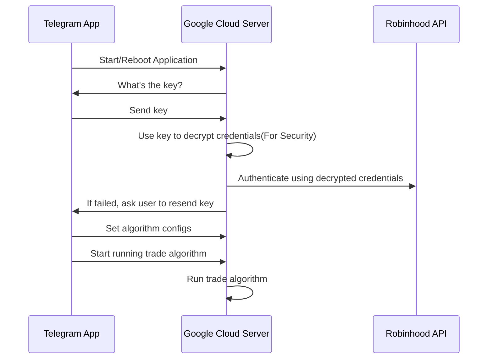
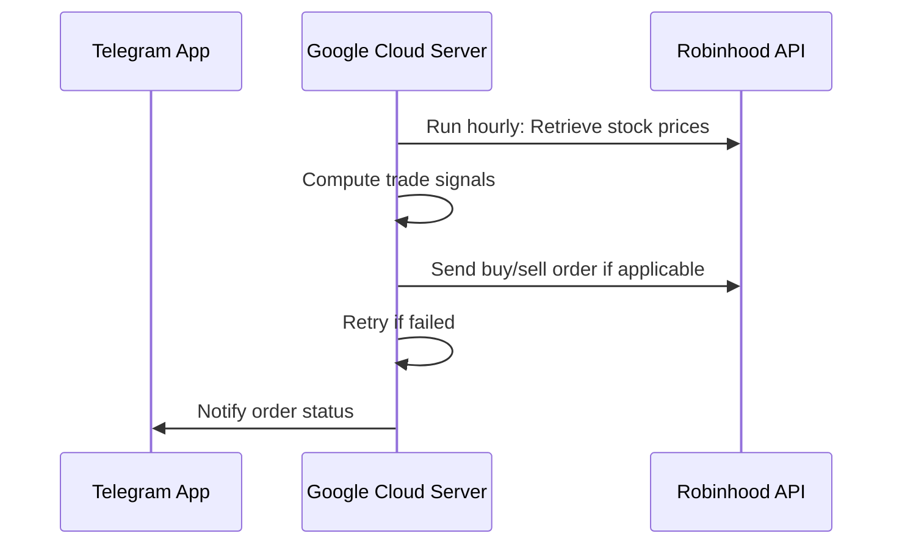
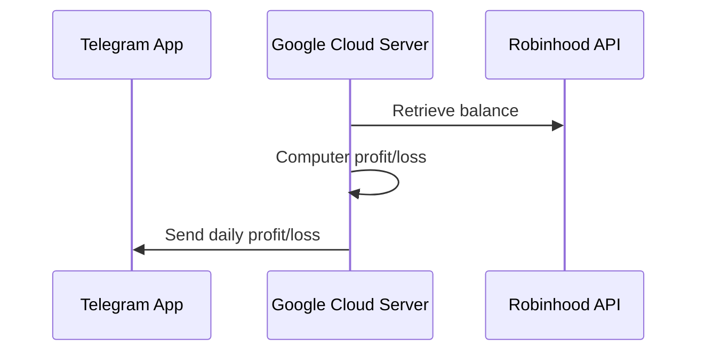

# Algorithmic Trading

## System Requirements and Design
- Security - avoid storing password directly on the virtual machine, or sending password through Telegram app
	- Password cryptography technique will be used to securely authenticate to Robinbood
		- Encrypted password will be stored on the Google's VM
		- Encryption key will be sent via Telegram App
		- Password will be decrypted during the initialization phase and it will be used to authenticate to Robinhood
- Execution - how to run the trade algorithm
	- The algorithm will retrieve historical data every half an hour
	- Trade algorithms will be run every half an hour. It will look at stock prices, and buy/sell signals will be generated during this time
	- Need a manual override to trigger buy/sell order
	- Weight mechanism - able to change the % of the total equity to invest in
- Investment Status - able to track balances, and daily changes
	- Need to be able to track daily profit/loss for each stock
	- Need a generated chart to view weekly changes

## Tech Stack
- Python3
- Pip3
- [robinhood-unofficial/pyrh](https://github.com/robinhood-unofficial/pyrh)
- [python-telegram-bot/python-telegram-bot](https://github.com/python-telegram-bot/python-telegram-bot)

## Execution Flow
### Initialization

### On Price Update (Every Half an Hour)

### Profit/Loss (Daily)

## In Action

