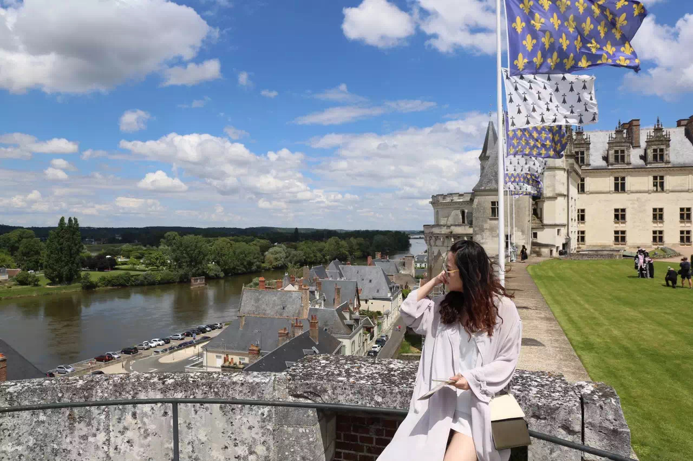

# Introduction
Everyone is unique in their own ways, the environment you grow up in can have an influence, but it does not define you. I’m truly grateful to have my own identity, as it took a lot of life experience to become the person that I am today. A picture is worth a thousand words, the pictures below can show you a little bit about me, but not the whole me, thanks for reading.

### Once a year, I would take a trip to explore a new mountain, seeing what nature looks like on the top of the mountain makes hours of hiking worthwhile.
---

### I enjoy taking on new challenges, teaching myself programming to perform analytics on the current world trends became one of my favorite pastime activities.
---

### I’m grateful to my parents for always being there for me, watching me achieve one of the most important milestones of my life and many more to come.
---

### Since 16, I have a goal of traveling the world, and I’m making good progress to date.
---

### I was lucky to be raised by my grandma in my early childhood, she always taught me never to underestimate what I can do, never underestimate what women can do.
---

### Spending 7 years by myself in Toronto has taught me a lot of things, one of which is becoming independent.

<!--stackedit_data:
eyJoaXN0b3J5IjpbLTE0NTUzOTMwNTQsNDk4OTkxMzE1LC04NT
g0NDk4MTYsLTcyMjkwNjI5OSwtNTMwNDgxODAyLDE4OTg3MTU5
MCwtMjA0NjM2MDQ4NSw5ODE0NjEzNDgsLTE5NDY3MTc1NDUsLT
EyOTQxNjU3OTVdfQ==
-->